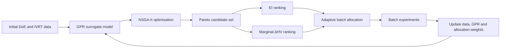

<div align="center">

# Active learning-based adaptive optimisation for developing dermal drug formulations

[](https://doi.org/10.1016/j.cherd.2026.07.035)
[](https://www.sciencedirect.com/science/article/pii/S0263876226004697)
[](https://www.python.org/)

**Yu Zhang · Yongrui Xiao · Xilu Wang · Dimitrios Tsaoulidis · Tao Chen**

Research code supporting the article published in *Chemical Engineering Research and Design*.

[Read the article](https://doi.org/10.1016/j.cherd.2026.07.035)

</div>

---

## Overview

Dermal formulation development involves optimising multicomponent mixtures under limited experimental budgets. This repository contains the research code for an active learning-based adaptive optimisation framework designed for **batch formulation experiments**.

The framework combines:

- **Gaussian process regression (GPR)** to predict formulation performance and quantify model uncertainty;
- **NSGA-II multi-objective optimisation** to identify Pareto-optimal candidates spanning predicted drug release and uncertainty;
- **Expected improvement (EI)** to prioritise candidates likely to improve the current best formulation;
- **Marginal hypervolume contribution (ΔHV)** to maintain exploratory diversity across the Pareto front; and
- an **adaptive allocation strategy** that updates the experimental budget assigned to EI- and ΔHV-ranked candidates according to their observed success in previous batches.

The approach was evaluated using five numerical benchmark functions and a real-world ibuprofen-loaded poloxamer 407 dermal formulation case measured by an **in vitro release test (IVRT)**.

## Methodology



## Key findings

- Across the five benchmark functions, the adaptive framework achieved the best performance in most evaluated settings and tied with the strongest alternative in the remainder.
- It remained competitive with sequential Bayesian optimisation while requiring approximately **six times fewer surrogate-model updates**.
- In the IVRT formulation study, the framework identified formulations with substantially higher release than the initial incumbent, reaching a cumulative improvement of **599.78 μg/cm²**.
- The adaptive allocation mechanism preserves both exploitation and exploration while operating under a fixed batch budget.

## Repository structure

```text
AL_AO/
├── Benchmark Cases/
│   ├── Package Module-III-sphere/
│   ├── Package Module-III-ackley/
│   ├── Package Module-III-griewank/
│   ├── Package Module-III-rastrigin/
│   ├── Package Module-III-zakharov/
│   └── Improvement/
├── Dermal_Drug_Formulations/
└── README.md
```

| Directory | Description |
|---|---|
| `Benchmark Cases/` | Implementations and comparisons for the Sphere, Ackley, Griewank, Rastrigin and Zakharov benchmark functions. |
| `Dermal_Drug_Formulations/` | GPR modelling, LOOCV, NSGA-II search, EI/ΔHV calculations and batch-wise dermal formulation optimisation scripts. |

## Requirements

The code was developed in Python and mainly uses the following packages:

```bash
pip install numpy pandas scipy scikit-learn matplotlib bayesian-optimization pymoo openpyxl joblib tabulate icecream
```

## Running the code

Clone the repository and enter the project directory:

```bash
git clone https://github.com/yurbro/Yu-Zhang-PhD.git
cd Yu-Zhang-PhD/AL_AO
```

Example benchmark scripts are available inside each benchmark package, including:

```text
single_bo_custom.py
multi_objective_optimisation.py
acquisition_function.py
```

The dermal formulation scripts are located in:

```text
Dermal_Drug_Formulations/
```

> **Important:** This repository contains research scripts rather than a packaged command-line application. Several scripts use project-specific Excel files, manually selected optimisation epochs and Windows-style paths. Update the input/output paths and relevant configuration variables before running the code on another system.

## Citation

Please cite the following article when using this code:

> Zhang, Y., Xiao, Y., Wang, X., Tsaoulidis, D., & Chen, T. (2026). Active learning-based adaptive optimisation for developing dermal drug formulations. *Chemical Engineering Research and Design*. https://doi.org/10.1016/j.cherd.2026.07.035

```bibtex
@article{Zhang2026ActiveLearning,
  author  = {Zhang, Yu and Xiao, Yongrui and Wang, Xilu and Tsaoulidis, Dimitrios and Chen, Tao},
  title   = {Active learning-based adaptive optimisation for developing dermal drug formulations},
  journal = {Chemical Engineering Research and Design},
  year    = {2026},
  doi     = {10.1016/j.cherd.2026.07.035},
  url     = {https://doi.org/10.1016/j.cherd.2026.07.035}
}
```

## Contact

For questions about the code or study, please contact:

**Yu Zhang**  
School of Chemistry and Chemical Engineering  
University of Surrey  
Email: yu.zhang@surrey.ac.uk

## License

This project is distributed under the repository's [license](../LICENSE).