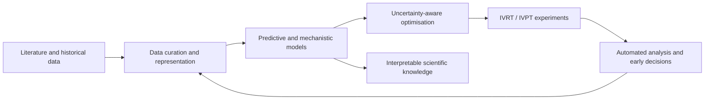

<div align="center">

# AI and Digital-Twin Methods for Skin Product Formulation Design

[](https://www.surrey.ac.uk/)
[](https://www.python.org/)
[](LICENSE)
[](https://orcid.org/0000-0002-8389-6716)

**Yu Zhang — PhD Researcher, University of Surrey**

Research code, datasets and reproducibility materials for data-driven dermal and topical formulation development.

</div>

---

## Overview

This repository brings together the main computational projects developed during my PhD research on **AI-enabled skin product formulation design**. The work combines experimental dermal delivery studies with machine learning, optimisation, mechanistic modelling and scientific data engineering.

The broader research objective is to develop an increasingly autonomous formulation-design workflow that can:

- learn from limited and heterogeneous formulation data;
- quantify predictive uncertainty;
- select informative and high-performing experiments;
- terminate unpromising long-running experiments early;
- derive interpretable relationships between formulation composition and drug-release behaviour; and
- connect literature knowledge, automated experimentation and decision-making within a closed loop.

## Research themes

- Artificial intelligence for formulation design and optimisation
- Active learning and Bayesian optimisation
- Gaussian process regression and uncertainty quantification
- Digital twins and closed-loop experimentation
- In vitro release and permeation testing (IVRT/IVPT)
- Symbolic regression and interpretable dynamic modelling
- Large language models for scientific data extraction and reasoning
- Dermal and transdermal drug delivery

## Repository projects

| Project | Purpose | Related output |
|---|---|---|
| [`AL_AO/`](AL_AO/) | Active learning-based adaptive batch optimisation using GPR, NSGA-II, expected improvement and hypervolume contribution. | [Chemical Engineering Research and Design article](https://doi.org/10.1016/j.cherd.2026.07.035) |
| [`EDMA/`](EDMA/) | Early decision-making for stopping unpromising topical formulation experiments before completion. | [Computers & Chemical Engineering article](https://doi.org/10.1016/j.compchemeng.2025.109224) |
| [`DKC-SR/`](DKC-SR/) | Domain-knowledge-constrained symbolic regression for interpretable dermal drug-release modelling and optimisation. | Manuscript and reproducibility materials |
| [`LlmDM/`](LlmDM/) | LLM-assisted literature screening, evidence extraction and construction of dermal permeation datasets. | PermeationNet and related data-engineering workflows |

> Each project directory contains its own README or supporting documentation. Several folders contain research scripts rather than packaged software, so local file paths, data locations and configuration values may need to be adapted before execution.

## Publications

### Research articles

1. **Zhang, Y., Xiao, Y., Wang, X., Tsaoulidis, D., & Chen, T.** (2026). Active learning-based adaptive optimisation for developing dermal drug formulations. *Chemical Engineering Research and Design*.  
   [DOI: 10.1016/j.cherd.2026.07.035](https://doi.org/10.1016/j.cherd.2026.07.035) · [Code](AL_AO/)

2. **Zhang, Y., Xiao, Y., Tsaoulidis, D., & Chen, T.** (2025). An early decision-making algorithm for accelerating topical drug formulation optimisation. *Computers & Chemical Engineering, 201*, 109224.  
   [DOI: 10.1016/j.compchemeng.2025.109224](https://doi.org/10.1016/j.compchemeng.2025.109224) · [Code](EDMA/)

### Review article

3. **Zhang, Y., Xiao, Y., Chen, C., Tsaoulidis, D., Yang, K., & Chen, T.** (2026). Autonomous AI-Driven Design for Skin Product Formulations. *Advanced Intelligent Discovery*, e70100.  
   [DOI: 10.1002/aidi.202500239](https://doi.org/10.1002/aidi.202500239) · [Open-access article](https://advanced.onlinelibrary.wiley.com/doi/full/10.1002/aidi.202500239)

The review presents an assay-aware closed-loop framework for autonomous skin-product development, integrating intelligent candidate generation, automated experiment selection, robotic and modular experimental platforms, automated analytics, hybrid mechanistic/data-driven models, uncertainty quantification and cross-tier calibration between rapid screens and pivotal dermal assays.

## Conceptual research workflow



## Getting started

Clone the complete repository:

```bash
git clone https://github.com/yurbro/Yu-Zhang-PhD.git
cd Yu-Zhang-PhD
```

Then enter the relevant project directory and consult its README:

```bash
cd AL_AO
# or: cd EDMA
# or: cd DKC-SR
# or: cd LlmDM
```

The projects are primarily written in Python and commonly use packages such as NumPy, pandas, SciPy, scikit-learn, Matplotlib, `bayesian-optimization`, `pymoo`, OpenPyXL and joblib. Exact dependencies differ by project.

## Citation

Please cite the publication associated with the specific code or dataset that you use. Citation details and BibTeX entries are provided in the relevant project README files.

## Contact

**Yu Zhang**  
School of Chemistry and Chemical Engineering  
University of Surrey, Guildford, UK  
Email: [yu.zhang@surrey.ac.uk](mailto:yu.zhang@surrey.ac.uk)  
ORCID: [0000-0002-8389-6716](https://orcid.org/0000-0002-8389-6716)

Collaboration enquiries related to AI for formulation design, dermal drug delivery, active learning, digital twins and scientific LLM applications are welcome.

## Acknowledgements

Yu Zhang's PhD research is supported by the **China Scholarship Council** in partnership with the **University of Surrey** (Grant No. 202306440060).

## License

Unless otherwise specified within an individual project or dataset, the repository is distributed under the [MIT License](LICENSE).
